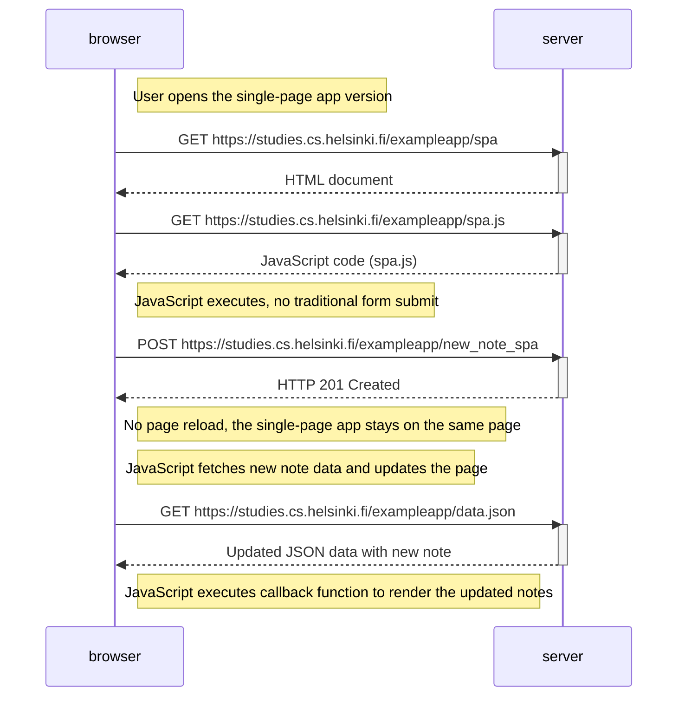

```mermaid
sequenceDiagram
    participant browser
    participant server

    Note right of browser: User opens the single-page app version

    browser->>server: GET https://studies.cs.helsinki.fi/exampleapp/spa
    activate server
    server-->>browser: HTML document
    deactivate server

    browser->>server: GET https://studies.cs.helsinki.fi/exampleapp/spa.js
    activate server
    server-->>browser: JavaScript code (spa.js)
    deactivate server

    Note right of browser: JavaScript executes, no traditional form submit

    browser->>server: POST https://studies.cs.helsinki.fi/exampleapp/new_note_spa
    activate server
    server-->>browser: HTTP 201 Created
    deactivate server

    Note right of browser: No page reload, the single-page app stays on the same page

    Note right of browser: JavaScript fetches new note data and updates the page

    browser->>server: GET https://studies.cs.helsinki.fi/exampleapp/data.json
    activate server
    server-->>browser: Updated JSON data with new note
    deactivate server

    Note right of browser: JavaScript executes callback function to render the updated notes
```
