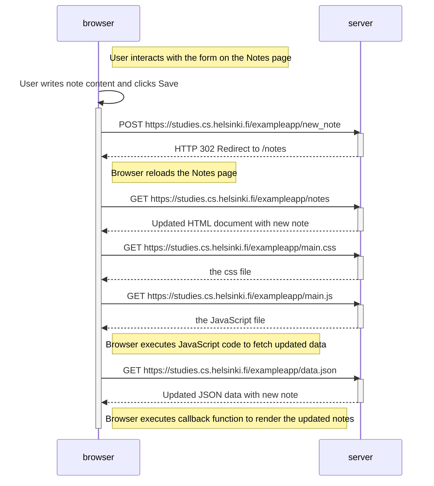

```mermaid
sequenceDiagram
    participant browser
    participant server

    Note right of browser: User interacts with the form on the Notes page

    browser->>browser: User writes note content and clicks Save
    activate browser

    browser->>server: POST https://studies.cs.helsinki.fi/exampleapp/new_note
    activate server
    server-->>browser: HTTP 302 Redirect to /notes
    deactivate server

    Note right of browser: Browser reloads the Notes page

    browser->>server: GET https://studies.cs.helsinki.fi/exampleapp/notes
    activate server
    server-->>browser: Updated HTML document with new note
    deactivate server

    browser->>server: GET https://studies.cs.helsinki.fi/exampleapp/main.css
    activate server
    server-->>browser: the css file
    deactivate server

    browser->>server: GET https://studies.cs.helsinki.fi/exampleapp/main.js
    activate server
    server-->>browser: the JavaScript file
    deactivate server

    Note right of browser: Browser executes JavaScript code to fetch updated data

    browser->>server: GET https://studies.cs.helsinki.fi/exampleapp/data.json
    activate server
    server-->>browser: Updated JSON data with new note
    deactivate server

    Note right of browser: Browser executes callback function to render the updated notes
    deactivate browser
```
